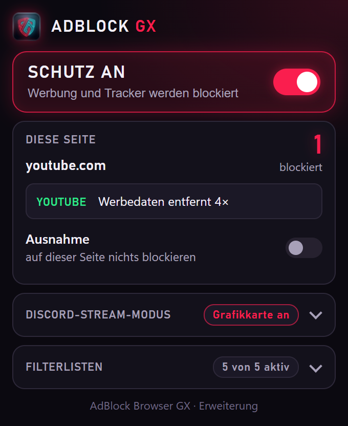
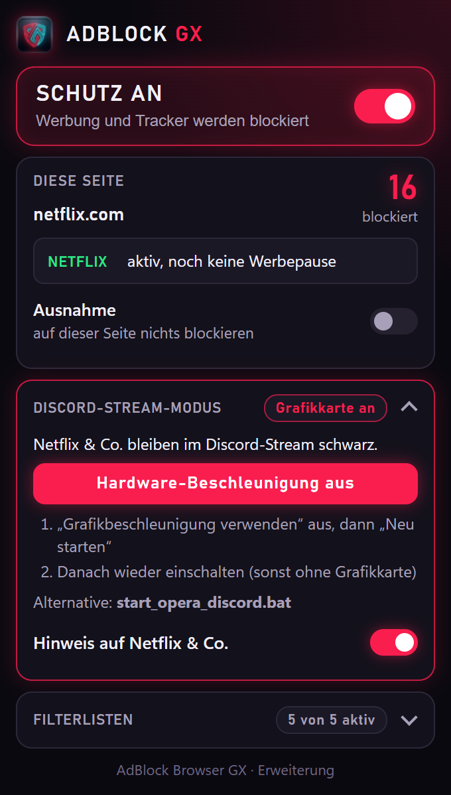
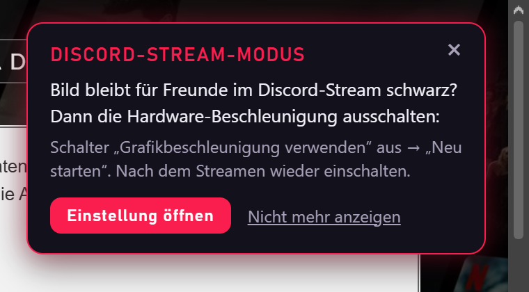

# 🛡️ AdBlock GX – Browser-Erweiterung (Chrome / Opera GX)

Werbeblocker als Erweiterung (Manifest V3) für **Chrome** und **Opera GX**, mit den Funktionen des
Desktop-Browsers [AdBlock Browser GX](https://github.com/abilas-sivarajah/adblock-browser-gx) – inklusive
**Discord-Stream-Modus**, damit Netflix im Discord-Bildschirm-Teilen nicht schwarz bleibt.

Die Seiten-Scripts (YouTube, Twitch, Netflix) werden **nicht kopiert**: Der Build erzeugt sie aus
`scripts/*.js` des Desktop-Browsers. Eine Änderung dort landet beim nächsten Build automatisch in der
Erweiterung.

---

## 🌟 Funktionen

- **Netzwerk-Blocker** (declarativeNetRequest): EasyList, EasyList Germany, Peter Lowe's Liste und
  EasyPrivacy plus die **Seiten-Fixes** des Desktop-Browsers (`site_fixes.txt`). Aus rund 117.000
  Netzwerk-Filtern werden ~14.700 Chrome-Regeln: reine Domain-Regeln (`||werbung.example^`) mit gleichen
  Optionen stehen gesammelt in **einer** Regel (Peter Lowe = 1 Regel). Damit passen alle Listen in die
  30.000 Regeln, die Chrome jeder Erweiterung garantiert. Die **Zahl am Symbol** zeigt die blockierten
  Anfragen des Tabs.
- **Werbeflächen ausblenden** (kosmetische Filter) wie im Desktop-Browser: Jeder Frame meldet seine
  CSS-Klassen/IDs, die Erweiterung antwortet mit den passenden Regeln der Listen (seitenspezifisch,
  generisch, Stil-Regeln). Eingefügt als Benutzer-Stylesheet – wirkt auch auf Seiten mit strenger
  Content-Security-Policy.
- **YouTube** ohne Werbung: Werbedaten werden aus den Player-Antworten entfernt, Reste übersprungen,
  Werbeblöcke und der Adblock-Hinweis ausgeblendet.
- **Twitch** ohne Video-Werbung: Werbung nur in deiner Sitzung (z. B. beim Öffnen eines Kanals) wird
  durch einen werbefreien Stream ersetzt. Bei einer Werbepause des Streamers (alle Zugänge haben dann
  Werbung) wird der Player abgedeckt und stumm geschaltet, mit Restzeit.
- **Netflix** (Abo mit Werbung): Werbepausen und Pausen-Werbung werden aus den Daten entfernt, ein
  durchgerutschter Spot wird abgedeckt.
- **South Park** (southpark.de) startet ohne Werbung (Seiten-Fixes).
- **Popup im GX-Look:** Schutz an/aus, Ausnahme für die aktuelle Seite, blockierte Anfragen, Status der
  YouTube/Twitch/Netflix-Scripts („Werbedaten entfernt 6ד), Filterlisten an/aus, Discord-Stream-Modus.

| Popup auf YouTube | Popup auf Netflix | Hinweis auf Netflix |
|---|---|---|
|  |  |  |

## 🚀 Bauen und laden

Voraussetzungen: **Python 3** (nur Standardbibliothek; **Pillow** optional für die Icons) und der
Desktop-Browser im Ordner **`AdBlockBrowser` neben diesem Repo**:

```powershell
git clone https://github.com/abilas-sivarajah/adblock-browser-gx AdBlockBrowser
git clone https://github.com/abilas-sivarajah/adblock-gx-extension AdBlockGX-Extension
cd AdBlockGX-Extension
python tools/build_extension.py
```

| Option | Wirkung |
|---|---|
| `--update` | Filterlisten neu laden (sonst Cache bis 12 h alt, `tools\.cache\filters\`) |
| `--offline` | nichts herunterladen (Cache, sonst die Listen des Desktop-Browsers) |
| `--browser PFAD` | Desktop-Browser liegt woanders (auch per Umgebungsvariable `ADBLOCK_BROWSER_DIR`) |

Der Build erzeugt `extension\generated\` (nicht in Git), meldet Regeln pro Liste, übersprungene Regeln
nach Grund und die Chrome-Limits.

**Laden:** `chrome://extensions` bzw. `opera://extensions` → **Entwicklermodus** an → **Entpackte
Erweiterung laden** → Ordner `extension\`. Danach das Symbol über das Puzzle-Menü anheften.

- Nach jedem neuen Build oder `git pull`: in `chrome://extensions` bei AdBlock GX auf **Neu laden** –
  sonst läuft der alte Code weiter.
- **Opera GX:** den eingebauten Werbeblocker von Opera ausschalten (Einstellungen → „Werbung
  blockieren“). Er kennt die Seiten-Fixes nicht – South Park meldet dann z. B. „Ad Blocker benutzt“.

## 🎮 Discord-Stream-Modus

Mit Hardware-Beschleunigung nutzt der Browser für Netflix den hardwaregeschützten Kopierschutz
(gemessen in Opera GX: PlayReady SL3000 nur mit Grafikkarte verfügbar). Das Video läuft dann über ein
geschütztes Overlay – Discord sieht nur **Schwarz**. Eine Erweiterung kann die Beschleunigung nicht
selbst abschalten und den Browser nicht mit Parametern neu starten, deshalb:

1. **Hinweis + Knopf** (getestet in Opera GX: Bild im Stream sichtbar): Die Erweiterung erkennt, ob die
   Grafikkarte genutzt wird. Popup → **„Hardware-Beschleunigung aus“** öffnet `chrome://settings/system`
   bzw. `opera://settings/system` → Schalter **„Grafikbeschleunigung verwenden“** aus → **„Neu
   starten“**. Das Popup zeigt dann „Stream-Modus an“. Nach dem Streamen wieder einschalten – sonst
   laufen Videos ohne Grafikkarte, Netflix evtl. in geringerer Auflösung.
   Auf Netflix, Prime Video und Disney+ erscheint dazu einmal pro Sitzung ein kleines Banner
   (im Popup abschaltbar).
2. **`start_opera_discord.bat`** (ohne Umschalten): startet Opera GX (sonst Chrome) mit denselben
   Parametern wie der Desktop-Browser (`--disable-gpu --disable-gpu-compositing
   --disable-accelerated-video-decode --disable-direct-composition-video-overlays`) in einem **eigenen
   Profil** (`%LOCALAPPDATA%\AdBlockGX\Discord-…`) – sonst würde ein schon laufender Browser die
   Parameter ignorieren. Ohne Adresse öffnet sich Netflix.
   - Im neuen Profil einmal bei Netflix anmelden. Den Kopierschutz (Widevine) lädt der Browser im neuen
     Profil erst nach ein paar Minuten nach – startet Netflix nicht sofort, kurz warten.
   - Opera lädt die Erweiterung über `--load-extension` selbst. **Chrome** erlaubt das nicht mehr: dort
     die Erweiterung im Discord-Profil einmal per Hand laden (siehe oben).
   - Desktop-Verknüpfung „Opera GX (Discord)“: `python tools/create_discord_shortcut.py` (braucht pywin32).

## ⚠️ Was nicht geht

- **Nur im Desktop-Browser:** eigener Fensterrahmen, Tabs, Startseite, Werbe-Protokoll, Popup-Blocker
  (Chrome/Opera blocken Popups selbst), Umschalten der Grafikkarte mit einem Klick.
- **Nicht umwandelbare Filter** werden beim Build übersprungen und gezählt: `$popup`, Seitensperren
  (`$document`, blockiert der Desktop-Browser auch nicht), `$redirect`, `$removeparam`, `$csp`,
  `$rewrite`, Scriptlets (`##+js(...)`), erweiterte Kosmetik (`#?#`, `#$#`, `:has-text`), und
  Regex-Regeln, die größer sind als Chrome erlaubt (ca. 100 RE2-Instruktionen, gemessen).
- **Seiten mit Ad-Shield** (z. B. wetter.com, welt.de): Wird deren Werbung geblockt, lädt Ad-Shield sie
  über wechselnde Domains nach; blockiert oder versteckt man auch das, löscht die Seite ihren Inhalt und
  zeigt eine Sperre („Ich verwende keinen Adblocker“). Dort bleibt Werbung sichtbar.
- **Twitch:** Während der Werbepause eines Streamers gibt es keinen werbefreien Stream – die Wartezeit
  bleibt (abgedeckt und stumm).
- `$important` liegt über normalen Block-Regeln, aber unter Ausnahmen (in der Brave-Engine des
  Desktop-Browsers gewinnt `$important` auch gegen Ausnahmen; betrifft nur ein Dutzend Regeln).

## 🔧 Technik

| | |
|---|---|
| Prioritäten | Ausnahmeliste (dynamisch, 100) > Seiten-Fix-Ausnahmen (4) > Ausnahmen der Listen (3) > `$important` (2) > Block (1) |
| `$domain=` | Listen: `initiatorDomains` (Frame, der anfragt – wie in uBlock/ABP). Seiten-Fixes: `topDomains` (Seite in der Adressleiste – wie der Desktop-Browser prüft). Daher `minimum_chrome_version` 145. |
| Ausnahmeliste | eine dynamische `allowAllRequests`-Regel für `main_frame`/`sub_frame`; die Seiten-Scripts bekommen sie als `excludeMatches` |
| Schutz aus | Regelsätze aus, Scripts abgemeldet, keine Kosmetik |
| Regelsätze | `site_fixes` immer an; die Listen an, soweit `getAvailableStaticRuleCount()` Platz lässt |

## 🧪 Tests

| Befehl | Prüft |
|---|---|
| `python dev_tests\dnr_unit.py` | Regel-Konverter: Filterzeilen rein → erwartete Chrome-Regeln raus (47 Tests) |
| `python dev_tests\ext_smoke.py` | Erweiterung in unsichtbarem Opera GX (eigenes Testprofil): Scripts, Regelsätze, Regex-Regeln, YouTube/Twitch/Netflix, Blockieren, Ausblenden trotz CSP, South Park, Ausnahme, Schutz aus, Neustart, `chrome://extensions` ohne Warnungen |
| `python dev_tests\ext_discord.py` | Discord-Stream-Modus in einem Opera-Fenster außerhalb des Bildschirms: Banner, Popup, Einstellungs-Knopf, Parameter der `.bat` |

Die Browser-Tests brauchen `pip install websockets` und Opera GX (`--browser` für einen anderen
Chromium-Browser; Chrome-Stable lädt keine Erweiterungen per Parameter). Die Node-Tests der
Seiten-Scripts (`nf_unit.js`, `tw_unit.js`) liegen im Repo des Desktop-Browsers.

## 📁 Projektstruktur

```
AdBlockGX-Extension/
├── extension/
│   ├── manifest.json          # Manifest V3 (Regelsätze trägt der Build ein)
│   ├── background.js          # Service Worker: Scripts registrieren, Regelsätze, Ausnahmeliste, Kosmetik, Discord
│   ├── popup.html/.js/.css    # Popup im GX-Look
│   ├── gpu.js                 # erkennt, ob die Hardware-Beschleunigung an ist
│   ├── content/cosmetic.js    # Klassen/IDs melden (alle Frames)
│   ├── content/discord_hint.js# Hinweis-Banner auf Netflix, Prime Video, Disney+
│   ├── icons/                 # aus assets/icon.png des Desktop-Browsers
│   └── generated/             # vom Build (nicht in Git)
├── tools/
│   ├── build_extension.py     # Build
│   ├── abp2dnr.py             # Adblock-Syntax → declarativeNetRequest + Kosmetik-Daten
│   └── create_discord_shortcut.py
├── dev_tests/                 # dnr_unit.py, ext_smoke.py, ext_discord.py
├── docs/                      # Screenshots für diese README
└── start_opera_discord.bat    # Opera GX im Discord-Stream-Modus
```
